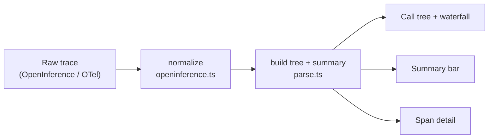

# 🔍 Tracelens

**A local-first, zero-backend viewer for AI agent traces.** Drop in an OpenInference / OTel GenAI trace and get a readable call tree with timings, tokens, cost, and errors — like DevTools for a single agent run.

   

---

## Why

Debugging an agent usually means scrolling through deeply nested JSON at midnight, hunting for the one tool call that looped or the step that quietly failed.

The heavyweight observability platforms can show you this — but most of them want you to stand up a backend (ClickHouse, Postgres, Redis, a server) just to look at a run. That is the right tool for production fleets. It is the wrong tool for "I have one trace and I want to understand it _right now_."

**Tracelens is the lightweight companion.** Open a trace, see everything, close the tab. No account, no server, no upload — the file never leaves your browser.

## What it does (v0)

- **Reads the emerging standard** — OpenInference attributes, with an OTel GenAI (`gen_ai.*`) fallback, so it is framework-agnostic by design.
- **Call tree with an inline waterfall** — every span is colored by kind (LLM, tool, retriever, agent…) and shows where in the run it happened and how long it took.
- **Roll-ups at a glance** — total duration, span count, LLM vs tool calls, tokens in/out, cost, and error count.
- **Errors stand out** — failed spans are flagged in red and carry their status message.
- **A detail panel for each span** — input, output, model, tokens, cost, and the raw attributes.
- **Bundled sample traces** — run it and click one; nothing to set up.
- **100% client-side.** Static build, works offline, nothing is uploaded.

## Quickstart

```bash
npm install
npm run dev
```

Open the printed URL (default `http://localhost:5173`), then **click a sample** or **drop your own trace file**.

```bash
npm run build      # production build to dist/
npm run preview    # serve the built app
npm test           # run the core test suite (Vitest)
npm run typecheck  # strict type check
```

## Deploy

Tracelens is a static single-page app — `npm run build` emits a self-contained bundle in `dist/` that you can host anywhere. No server, no environment variables, no secrets; the trace file never leaves the browser, so any plain static host is enough.

- **Netlify / Vercel / Cloudflare Pages** — point the project at this repo, set the build command to `npm run build` and the publish directory to `dist/`. That's the whole setup.
- **GitHub Pages / any sub-path host** — when the app is served from a sub-path (e.g. `https://you.github.io/tracelens/`), set Vite's [`base`](https://vitejs.dev/config/shared-options.html#base) to that path (`base: '/tracelens/'` in `vite.config.ts`) and rebuild. The bundled sample fetches already go through `import.meta.env.BASE_URL`, so they resolve correctly under any base.
- **Locally** — `npm run preview` serves the built `dist/` so you can sanity-check the production bundle before shipping.

## Loading your own trace

Tracelens accepts a JSON **array of spans**, or an object shaped like `{ "spans": [ … ] }`. Each span looks like:

```json
{
  "span_id": "a3",
  "parent_span_id": "a1",
  "name": "tool.web_search",
  "start_time": "2026-06-18T10:00:01.380Z",
  "end_time": "2026-06-18T10:00:03.120Z",
  "status_code": "OK",
  "attributes": {
    "openinference.span.kind": "TOOL",
    "tool.name": "web_search",
    "input.value": "...",
    "output.value": "..."
  }
}
```

Times may be ISO strings, epoch milliseconds, or OTLP unix-nanoseconds. The recognized attributes (span kind, token counts, cost, model, input/output, tool name) live in [`src/core/openinference.ts`](src/core/openinference.ts) — adding support for another exporter is a few lines there. See [`public/samples/`](public/samples) for complete, working examples.

## Architecture

The parsing core is deliberately separate from the UI: it is pure, dependency-free, and unit-tested, so it could ship as a standalone npm package and the React layer is just a renderer over its output.



```
src/
├─ core/                 # framework-agnostic, no React, fully tested
│  ├─ types.ts           #   the canonical span/tree/summary model
│  ├─ openinference.ts   #   raw attributes  ->  canonical model
│  ├─ parse.ts           #   flat spans      ->  tree + roll-up summary
│  ├─ format.ts          #   duration / token / cost formatting
│  └─ parse.test.ts      #   Vitest suite
├─ lib/
│  └─ kinds.ts           # the signature: span kind -> color
└─ components/           # the viewer (tree, waterfall row, detail, loader, summary)
```

## Roadmap

**v0 — now.** Parse a trace, render the tree + inline waterfall, detail panel, bundled samples.

**v1 — make it a debugger.**
- Diff two runs side by side (catch regressions)
- Token / cost flamegraph — where did the time and money go
- Search across spans and jump straight to errors or loops
- Shareable export: a self-contained HTML file or a URL-encoded trace, so a teammate can open a failing run with one click
- Import adapters for Langfuse / LangSmith / Phoenix exports and raw OpenAI / Anthropic SDK logs

**v2 — make it a layer others build on.**
- Publish the components as a headless, shadcn-style library to drop into any app
- A Tauri desktop build that tails local agent logs live
- Span annotations that export to evaluation datasets

## Renaming the project

The name appears in exactly three places: the `name` field in `package.json`, the wordmark in `src/App.tsx`, and the `<title>` in `index.html`. Change those and you're done. (Check that the name is free on npm and GitHub before you publish.)

## Contributing

PRs welcome — the highest-leverage contributions are **new trace-format adapters** in `src/core/openinference.ts` and **sample traces** in `public/samples/`. Please run `npm test` before opening a PR.

## License

MIT © 2026 LiDesheng926
