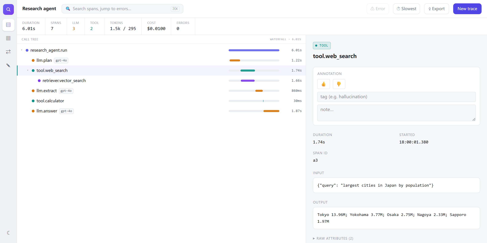
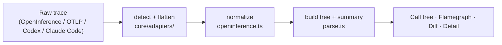

# 🔍 Tracelens

**A local-first, zero-backend debugger for AI agent traces.** Drop in a trace — OpenInference, OTel/OTLP, Codex, or Claude Code — and get a readable call tree with timings, tokens, cost, and errors. Search it, flamegraph it, diff two runs, share it by link — like DevTools for a single agent run.

[](https://yuleo926.github.io/tracelens/)    

**▶ [Try it live → yuleo926.github.io/tracelens](https://yuleo926.github.io/tracelens/)** — runs entirely in your browser, no install, nothing uploaded.

<picture>
  <source media="(prefers-color-scheme: dark)" srcset="docs/hero-dark.png">
  
</picture>

---

<a id="analyze-a-codex-run"></a>

## Connect ChatGPT desktop / Codex

**Prerequisites:** Node.js 20 or newer, a desktop client with local MCP support, and at least one supported local agent session. The Codex CLI is needed only for the setup command below; desktop settings also support manual registration.

Register TraceLens in the shared local MCP configuration:

```bash
npx @yuleo/tracelens setup codex
```

The command remains `setup codex` for compatibility. The current ChatGPT desktop app, Codex CLI and IDE extension share MCP configuration on the same Codex host. In the desktop app, open **Settings > MCP servers**, enable TraceLens and select **Restart**. Start a new **local Codex task** in the project you want to inspect, check `/mcp` for TraceLens, then ask:

> Use TraceLens to analyze the most recent abnormal run in this project.

TraceLens ranks recent sessions for the current project and gives the calling agent bounded, read-only evidence. No separate model API or TraceLens account is required. Registration does not prove that the current chat can call the tools; complete the workflow below to verify the client.

**Desktop setup without the Codex CLI:** in **Settings > MCP servers > Add server**, enter name `tracelens`, transport **STDIO**, command `npx`, and arguments `-y`, `@yuleo/tracelens@0.2.3`, `mcp` as separate arguments. Save, enable and restart the server. Do not replace an existing registration without checking what it runs.

**Testing a source checkout:** run `npm run build`, then register `node` with the absolute path to this checkout's `dist-cli/index.js` followed by `mcp`, instead of the npm command. This uses the local build, not the npm package. Rebuild after code changes and restart the MCP server. Moving this checkout requires updating that path.

This integration follows the [official local MCP documentation](https://learn.chatgpt.com/docs/extend/mcp). ChatGPT web and hosted tasks do not read a local Codex configuration file; this setup does not turn TraceLens into a public or remote MCP service.

### What is supported

| Capability | Status |
| --- | --- |
| Find and inspect local Codex / Claude Code sessions | Supported through the existing local MCP server |
| Open cited events in the local browser viewer | Supported on the machine running TraceLens |
| Use another GPT model to analyze the same logs | The tool protocol is model-independent; log-format support and model-price coverage are separate |
| Automatically read ordinary ChatGPT Chat / Work conversation history | Not implemented; MCP registration does not grant access to chat history |
| Import a ChatGPT account history export | Not implemented; do not treat it as a supported agent trace |

The desktop application name does not determine log compatibility. TraceLens currently discovers `~/.codex/sessions` and `~/.claude/projects`; it does not scrape the ChatGPT desktop app, read login credentials, or retrieve cloud conversation history. New desktop clients still need an actual tool-call verification. Missing tokens or unsupported pricing must not be interpreted as zero cost.

### What success looks like

The agent should call `list_sessions`, fetch `get_session_overview`, inspect relevant events with `get_event_detail`, explain what happened, and cite TraceLens event IDs. Then ask it to call `get_viewer_link` for a cited event and open that link. Confirm that the viewer shows the same session and event. A generic answer without tool calls is not a successful connection check. You can also run the viewer directly:

```bash
npx @yuleo/tracelens
```

An incomplete log may support observations without proving a root cause. Treat the cited events as the source of truth.

[Share first-run feedback](https://github.com/YuLeo926/tracelens/issues/new?template=first-run-feedback.yml) after trying the flow. The form is optional and public; do not include logs, paths, secrets, private code, prompts, or conversation contents.

### Self-service local check

With version 0.2.3 or newer:

```bash
npx @yuleo/tracelens@0.2.3 check
npx @yuleo/tracelens@0.2.3 check --json
```

In a source checkout, build once and run:

```bash
npm run build
node dist-cli/index.js check
node dist-cli/index.js check --json
```

The check verifies installed viewer assets, local session discovery, a synthetic trace, actual MCP stdio requests, and authenticated loopback evidence access. It does not upload logs, call a model, or modify configuration. It does **not** verify Codex's saved MCP registration or whether a Codex task can call the tools; verify that separately in a new task. Reports contain no session content or local paths. Exit codes: `0` passed, `2` warning (for example, no readable sessions), `1` failed. Version 0.2.2 does not include this command.

### First-run troubleshooting

- **TraceLens tools are missing:** check **Settings > MCP servers** on the intended local host, enable TraceLens, select **Restart**, and start a new local Codex task. Check `/mcp`; an already-running conversation may not acquire newly registered tools.
- **No supported sessions were found:** run Codex in the project first, or open a supported file with `npx @yuleo/tracelens open <file>`.
- **The wrong project session was selected:** start the Codex task from the intended project directory and ask TraceLens to list the candidate sessions before choosing one.
- **A different TraceLens registration already exists:** inspect it with `codex mcp get tracelens --json`; replace it only when intended with `npx @yuleo/tracelens setup codex --force`.
- **You want to verify the evidence:** ask Codex for a TraceLens viewer link or run `npx @yuleo/tracelens list`.

Setup is idempotent and pins the installed TraceLens version. Evidence requested through MCP enters the requesting ChatGPT / Codex conversation and follows that conversation's data handling. Log text is treated as untrusted evidence and is never executed by TraceLens.

| Tool | Evidence returned |
| --- | --- |
| `list_sessions` | Compact metadata, totals, and observed signals by default. Detailed evidence is fetched on demand. |
| `get_session_overview` | Lifecycle, totals, and bounded lists of errors, slow events, token-heavy events, and repeated operations. |
| `get_session_timeline` | A chronological, filterable page of event references with short snippets. |
| `search_session` | Bounded matches across normalized event names, inputs, outputs, status messages, and selected attributes. |
| `get_event_detail` | One event's normalized metadata and bounded input, output, status, token, and attribute evidence. |
| `get_viewer_link` | An authenticated loopback link to the selected session and optional event; it does not open a browser. |

TraceLens has no model API and does not upload data independently. Evidence returned through MCP enters the requesting ChatGPT / Codex conversation and is subject to that conversation's data handling. Log text is treated as untrusted evidence: TraceLens does not execute commands, follow URLs, or change files based on instructions found in a run.

`list_sessions` accepts `query` (title/project/provider metadata, not log-body search), inclusive `since`/`until` (modified time in epoch milliseconds), and `signal`: `tool_errors`, `repeated_failures`, `recovered`, `stopped`, `active`, or `unknown`. Filters run before the result limit. Use `detail: "full"` for the previous detailed list shape, or `get_session_overview` for one candidate. Filtering never silently switches away from the current project when that project has sessions.

Browser lists support keyword, local-calendar modified dates, and observed-signal filters. The local viewer's session picker filters its loaded recent candidates; MCP filters can search the broader discovered set. A retry succeeding means an observed successful call after failure of the same operation, not proof that the whole task was fixed. Browser signal scanning skips files over 30 MB; unscanned files are marked "Not analyzed", not successful.

### Costs and sharing

The folder dashboard separates usage priced with the bundled model table, generic fallback-rate estimates, and sessions with missing usage (excluded from cost totals, not counted as free). Model-table matches are still estimates, not invoices: rates can age, logs may omit usage, and a session may switch models. This optimization does not refresh the pricing table.

Share links and trace JSON downloads now open a review dialog first. The export is a normalized snapshot with remapped event IDs, best-effort masking of common credentials and absolute paths, and only supported primitive attributes. It is not a lossless raw-log export. Private code and conversation prose may remain; review the exact content and confirm before copying or downloading. The original file is never changed. Anyone with a share link can read the embedded export. Oversized links are rejected; use the reviewed JSON download instead. Annotation exports are separate and should also be checked for private notes.

### Browser workflow

- Choose a trace file using the import button, drag a file onto the page, or open a local folder. Folders start on the conversation list; the folder-wide dashboard remains in **Overview**.
- Imported files and selected sessions open the same run overview. Select an error, slow event, or token-heavy event to inspect its evidence. **Follow newest** still opens the live call tree.
- **Sessions** returns to the folder list or local session picker, retaining filters and scroll position. Opening a new source resets this context.
- Event details show errors, input, and output first. **Annotations** is a separate disclosure below the evidence. On narrow screens, details use the full width; **Back to events** returns to the selected row.
- Export review offers readable **Events** and **Complete JSON** views. Filtering the preview does not filter the export. Every export requires a fresh confirmation of the entire frozen snapshot.

Live watching checks modification time and file size before reading content: unchanged polls do not reread or reparse the log. Changed files still receive a full parse. Incremental parsing and list virtualization remain future work.

## Why

Debugging an agent usually means scrolling through deeply nested JSON at midnight, hunting for the one tool call that looped or the step that quietly failed.

The heavyweight observability platforms can show you this — but most of them want you to stand up a backend (ClickHouse, Postgres, Redis, a server) just to look at a run. That is the right tool for production fleets. It is the wrong tool for "I have one trace and I want to understand it _right now_."

**Tracelens is the lightweight companion.** Open a trace, see everything, close the tab. No account, no server, no upload — the file never leaves your browser.

## What it does

- **Reads many formats, auto-detected** — OpenInference / OTel GenAI, raw OpenTelemetry (OTLP) JSON, Codex (`codex exec --json` and saved session rollouts), Claude Code transcripts, and raw Anthropic Messages logs — as JSON or JSONL. Drop the file; Tracelens figures out the format.
- **Call tree with an inline waterfall** — every span is colored by kind (LLM, tool, retriever, agent…) and shows where in the run it happened and how long it took.
- **Model thinking, surfaced** — Claude Code `thinking` blocks and Codex `reasoning` summaries show up as their own rows in the tree, right where they happened; click one to read the model's recorded thought process in full. They're searchable and annotatable like any other span — rate the *thinking*, not just the answer, when building eval sets. (This shows the thinking text your logs already record; encrypted thinking is marked as such, and it's not a window into model internals.)
- **Live tail + conversation browser (Chromium)** — point it at a local agent-log folder (e.g. `~/.codex/sessions` or `~/.claude/projects`) and **browse its conversations**, each labeled by its first message and project (read from the file's head, so it's fast even with huge logs), newest first and filterable. Open any one to read it — watching **live** if it's still being written — or hit **Follow newest** to track the active run as it unfolds, auto-jumping to the latest step and pausing the moment you start inspecting (a "back to live" pill catches you up). Files are read straight from disk in your browser; nothing is uploaded.
- **Folder overview dashboard** — opening a folder also gives you a bird's-eye **Overview** tab: total conversations, token usage with a cache-aware **rough cost estimate** (per-model rates for GPT-5.x / Codex / Claude), a 14-day activity timeline, a breakdown by project, and **runs with errors**. Usage is streamed from complete JSONL files and cached by file metadata; non-trace files are sniffed out so stray `.json` does not pollute the counts.
- **Search + jump** — filter the tree as you type (`⌘K`) across names, models, input/output, and jump straight to the next error or the slowest span.
- **Flamegraph** — see where the time and the money went, weighted by duration, tokens, or cost.
- **Diff two runs** — load a second trace and compare: a summary delta bar (regressions in red, improvements in green) over a merged tree that flags what changed, was added, or removed.
- **Annotate + export an eval set** — rate any span 👍/👎 with a tag and a note in the detail panel; annotations are saved in your browser (per conversation, auto-restored) and marked in the tree. Export them as **JSONL** or **CSV** — this conversation or all — to turn real runs into an evaluation dataset.
- **Shareable export** — copy a self-loading link (the trace lives in the URL) or download the JSON; nothing is uploaded.
- **Roll-ups, errors, and a detail panel** — total duration / tokens / cost / errors at a glance; failed spans flagged in red; per-span input, output, model, tokens, and raw attributes.
- **Light & dark**, bundled sample traces, and **100% client-side** — static build, works offline, the file never leaves your browser.

## Development

```bash
npm install
npm run dev
```

Open the printed URL (default `http://localhost:5173`), then **click a sample** or **drop your own trace file**.

```bash
npm run build      # production build to dist/
npm run preview    # serve the built app
npm test           # run the core test suite (Vitest)
npm run typecheck  # strict type check
```

For local use without Codex, `npx @yuleo/tracelens open <supported-file>` opens one supported file and `npx @yuleo/tracelens list` lets you select a recent discovered run. The hosted demo remains available for manual file and folder access without the CLI.

## Deploy

Tracelens is a static single-page app — `npm run build` emits a self-contained bundle in `dist/` that you can host anywhere. No server, no environment variables, no secrets; the trace file never leaves the browser, so any plain static host is enough.

- **Netlify / Vercel / Cloudflare Pages** — point the project at this repo, set the build command to `npm run build` and the publish directory to `dist/`. That's the whole setup.
- **GitHub Pages / any sub-path host** — when the app is served from a sub-path (e.g. `https://you.github.io/tracelens/`), set Vite's [`base`](https://vitejs.dev/config/shared-options.html#base) to that path (`base: '/tracelens/'` in `vite.config.ts`) and rebuild. The bundled sample fetches already go through `import.meta.env.BASE_URL`, so they resolve correctly under any base.
- **Locally** — `npm run preview` serves the built `dist/` so you can sanity-check the production bundle before shipping.

## Loading your own trace

Tracelens accepts a JSON **array of spans**, or an object shaped like `{ "spans": [ … ] }`. Each span looks like:

```json
{
  "span_id": "a3",
  "parent_span_id": "a1",
  "name": "tool.web_search",
  "start_time": "2026-06-18T10:00:01.380Z",
  "end_time": "2026-06-18T10:00:03.120Z",
  "status_code": "OK",
  "attributes": {
    "openinference.span.kind": "TOOL",
    "tool.name": "web_search",
    "input.value": "...",
    "output.value": "..."
  }
}
```

Times may be ISO strings, epoch milliseconds, or OTLP unix-nanoseconds. **The format is auto-detected** — besides the native span array, Tracelens reads OpenTelemetry (OTLP) JSON, Codex `codex exec --json` and saved session rollouts (`~/.codex/sessions/…`), Claude Code transcripts (`~/.claude/projects/…`), and raw Anthropic Messages logs, as JSON or JSONL. Each format is one small file in [`src/core/adapters/`](src/core/adapters) (the per-attribute mapping lives in [`src/core/openinference.ts`](src/core/openinference.ts)); adding another is a few lines. See [`public/samples/`](public/samples) for complete, working examples.

## Architecture

The parsing core is deliberately separate from the UI: it is pure, dependency-free, and unit-tested, so it could ship as a standalone npm package and the React layer is just a renderer over its output.


```mermaid
flowchart LR
  raw["Raw trace<br/>(OpenInference / OTLP / Codex / Claude Code)"] --> adapt["detect + flatten<br/>core/adapters/"]
  adapt --> norm["normalize<br/>openinference.ts"]
  norm --> parse["build tree + summary<br/>parse.ts"]
  parse --> views["Call tree · Flamegraph · Diff · Detail"]
```

```
src/
├─ core/                 # framework-agnostic, no React, fully tested
│  ├─ types.ts           #   canonical span/tree/summary model
│  ├─ adapters/          #   format detection: OTLP, Codex, Claude Code, native…
│  ├─ openinference.ts   #   raw attributes -> canonical model
│  ├─ parse.ts           #   spans -> tree + roll-up (JSON & JSONL aware)
│  ├─ search.ts          #   filter + error/slowest jumps
│  ├─ flame.ts           #   flamegraph aggregates + icicle layout
│  ├─ diff.ts            #   align two runs into a merged diff
│  ├─ share.ts           #   gzip + base64url share links
│  └─ format.ts          #   duration / token / cost formatting
├─ lib/                  # kinds (span kind -> color), view registry
├─ theme/                # light/dark provider (token-driven)
└─ components/           # shell · views (tree / flamegraph / diff) · detail · loader
```

## Roadmap

**v0 — shipped.** Parse a trace, render the tree + inline waterfall, detail panel, bundled samples.

**v1 — make it a debugger. ✅ shipped.**
- ✅ Diff two runs side by side (catch regressions)
- ✅ Token / cost flamegraph — where did the time and money go
- ✅ Search across spans and jump straight to errors / the slowest call
- ✅ Shareable export — a URL-encoded trace (and JSON download), so a teammate can open a failing run with one click
- ✅ Import adapters — OTLP/OpenTelemetry, Codex (`exec --json` **and** saved session rollouts), and Claude (Messages logs **and** Claude Code transcripts), JSON or JSONL

**v2 — watch runs live. ✅ shipped.**
- ✅ Live tail — watch a local agent-log folder (Codex / Claude Code) and follow the newest run as it's written, entirely in the browser (File System Access API, Chromium)
- ✅ Conversation browser — open a folder and pick a conversation from a list labeled by its first message + project, instead of guessing at timestamp-UUID filenames
- ✅ Span annotations — rate spans 👍/👎 with tags + notes (saved locally, auto-restored) and export them as JSONL/CSV evaluation datasets
- ✅ Folder overview dashboard — a per-folder Overview tab: conversations, tokens, a cache-aware rough cost estimate, a 14-day activity timeline, by-project breakdown, and runs-with-errors

**Backlog — parked until there's real demand.**
- Performance pass for very large logs — incremental tail reads + list virtualization, for when huge session files start to feel slow
- Headless component library — publish the views as a shadcn-style package to embed in other apps. Want this? [Open an issue](https://github.com/YuLeo926/tracelens/issues).
- Tauri desktop build — true push-based tailing and non-Chromium support, if the browser version ever falls short

## Renaming the project

The name appears in exactly three places: the `name` field in `package.json`, the wordmark in `src/App.tsx`, and the `<title>` in `index.html`. Change those and you're done. (Check that the name is free on npm and GitHub before you publish.)

## Contributing

PRs welcome — the highest-leverage contributions are **new trace-format adapters** in [`src/core/adapters/`](src/core/adapters) (each is one self-contained file with a `detect` + a `toLooseSpans`) and **sample traces** in `public/samples/`. Please run `npm test` before opening a PR.

## License

MIT © 2026 LiDesheng926
